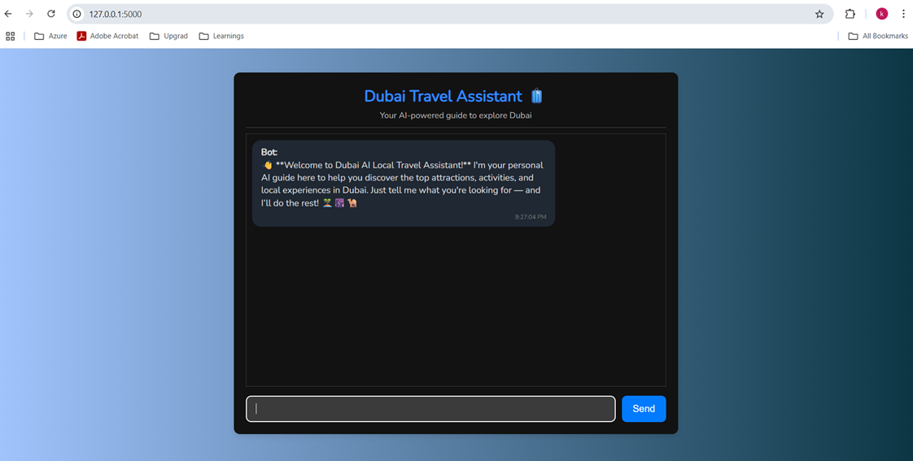
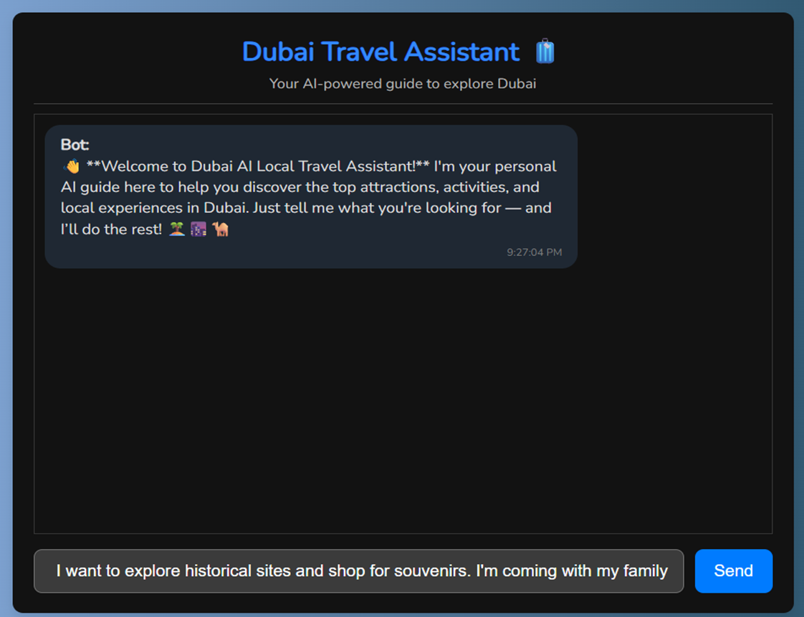
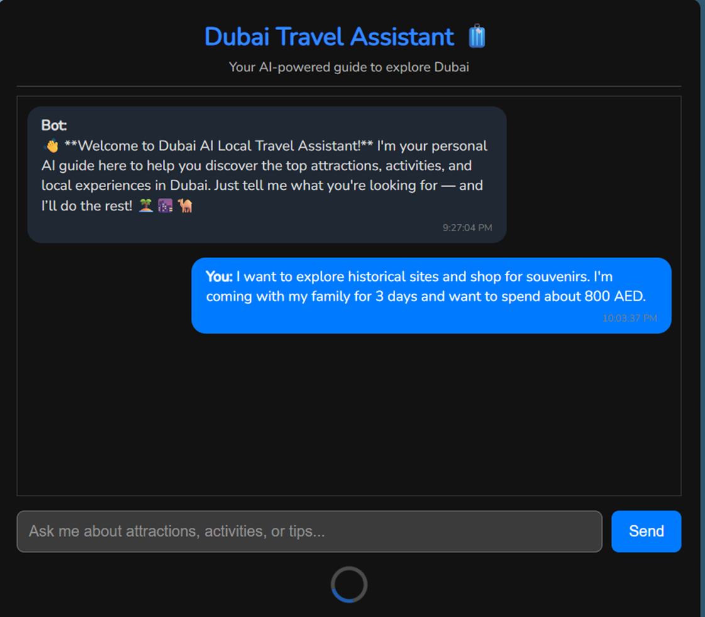
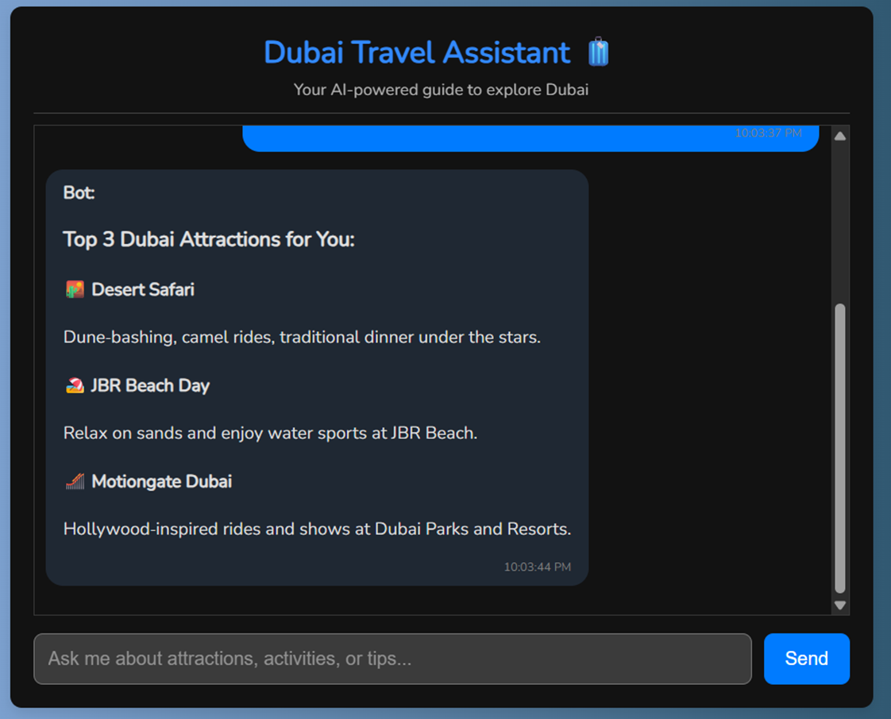

# Dubai_Local_Explorer_AI_Chatbot
The **Dubai Local Explorer AI Chatbot** is a conversational assistant designed to help users plan their travel experience in Dubai.

# 📘 Dubai Local Explorer AI Chatbot – System Documentation

---

### Problem Statement
Dubai, as one of the world’s most visited cities, presents a rich blend of attractions—cultural landmarks, modern entertainment hubs, shopping malls, beaches, and more. However, **travelers often struggle** to explore the city efficiently due to:

- **Overwhelming choices** with minimal personalization.

- **Language barriers**, especially with Arabic or mixed cultural signs and local dialects.

- **Lack of a single intelligent interface** that can help plan itineraries, provide local info, answer questions, and adjust dynamically.

- Difficulty in navigating real-time changes (e.g., weather, events, closures).

- The absence of context-aware digital guides who understand individual travel preferences.

Traditional apps (like Google Maps or TripAdvisor) are fragmented and reactive. Tourists still rely heavily on manual research, guidebooks, or static platforms that don’t adapt or personalize effectively.

### Project Overview
The Dubai Local Explorer AI Chatbot is a GPT-powered, context-aware virtual assistant designed to guide tourists in Dubai through real-time conversational interactions. It brings together the intelligence of natural language processing (NLP), real-time APIs, and curated city data to help users:

- Discover places to visit.

- Get personalized itineraries.

- Receive live assistance (navigation, translation, recommendations).

- Learn about local culture, rules, and tips.

The system runs through a chat interface and is designed to be modular and extensible—ideal for deployment across mobile apps, web apps, or messaging platforms (WhatsApp, Telegram, etc.).

### Project Objectives

**Traveler-centric Goals**

- Deliver contextual recommendations based on interest (e.g., art, adventure, food).

- Serve as an always-available digital concierge.

- Improve cultural understanding and navigation through translation and etiquette help.

**System-level Objectives**

- Utilize LLM-based dialogue management to maintain engaging, multi-turn conversations.

- Integrate with external data providers/APIs for up-to-date weather, events, transport, and venue information.

- Store and recall user preferences for personalized follow-ups.

- Provide multilingual communication (Arabic, English, Hindi/Urdu).

- Ensure scalability and adaptability for other cities or languages in the future.

### End to End high level workflow

User Input (Text or Voice)
       ↓
Intent Detection via LLM
       ↓
Extract Entities (location, time, preference)
       ↓
Check Context/History → Use Session Memory
       ↓
Trigger Module:
   - Place Recommendation
   - Itinerary Planner
   - Translate Menu / Sign
   - Local Info Q&A
       ↓
Query APIs or Internal Knowledge Base
       ↓
Response Formatting (Multilingual if needed)
       ↓
Display Answer → Update Context

### Functional Features

- Warm welcome message on chat open
- Real-time two-way chatbot interface
- Moderation checks on user input
- Personalized recommendations using function calls
- Rich formatting of results with emojis and details
- Error handling & validation throughout the flow

### Tech Stack

**Component**	  **Technology**
- Frontend	      HTML, CSS, JavaScript
- Backend	        Python (Flask)
- AI Model	      OpenAI GPT-3.5 Turbo
- UX Features	    Real-time chat, auto-scroll, welcome message
- Moderation	    OpenAI's moderation endpoint or custom logic
- Data Format	    CSV (for attractions and recommendations)

### Architecture Layers Explained
User → Web Interface → Flask → Chatbot Core → OpenAI API → Response → Flask → Web UI

**1. Intent Clarity Layer**
Prompts users to clarify vague input.
Input: “I want to do something fun.”
Output: “Are you looking for adventure, relaxation, or something cultural?”

**2. Intent Confirmation Layer**
Confirms extracted preferences before proceeding.
{
  "interests": ["food", "beaches"],
  "budget_aed": 500,
  "duration_days": 2,
  "group_type": "family"
}

**3. Product Mapping Layer**
Matches preferences with database items using weighted scoring.

**4. Product Information Extraction Layer**
Gathers metadata from selected experiences for enhanced recommendations.

**5. Product Recommendation Layer**
Presents results in user-friendly text with justification.

**6. (Optional) Moderation Layer**
Filters unsafe input using OpenAI Moderation API.

User Input -> Moderation -> Clarity -> Extraction -> Confirmation -> Mapping -> Info Extraction -> Recommendation -> Output

### Dubai Local Travel AI Chatbot Assist Flask App

**Travel Assist Welcome Screen:**
 

**User Request:**
 

**Assistant Interaction with Custom Bot with internal LLM GPT APIs**
 

**Dubai Travel AI Assist Chatbot Response:**
 

### Deployment Guide

1.	Download or clone the repo:
git clone https://github.com/mkviswanadh/Dubai_Local_Explorer_AI_Chatbot.git
2.	Navigate into the chatbot_app folder where app.py, dependencies, templates/static files reside.
3.	Create & Activate a Python Virtual Environment
•	In PowerShell or CMD:
cd path\to\chatbot_app
python -m venv venv
.\venv\Scripts\activate
4.	Install Dependencies
•	If the repo includes requirements.txt, install with:
pip install -r requirements.txt
•	If not, manually install likely packages:
pip install flask openai python-dotenv flask-cors
5.	Set Environment Variables
Flask needs to know which file is the entry point:
•	In CMD:
set FLASK_APP=app.py
set FLASK_ENV=development
•	In PowerShell:
$env:FLASK_APP = "app.py"
$env:FLASK_ENV = "development"
   
6.	Run the App
If FLASK_APP is set:
flask run
By default, this listens on localhost:5000
7.	Check in Browser
Open your browser:
http://127.0.0.1:5000
or
http://localhost:5000
You should see the chatbot interface or default home page rendered.

### Future Scope of Work for Dubai Local Explorer AI Chatbot

1. **Context-Aware Memory & Session Persistence**

    ***Objective:*** Implement a memory module to retain user profiles, preferences, and past interactions across sessions.

    ***Implementation:***

    - Utilize technologies like Redis or vector databases (e.g., Pinecone, FAISS) for session storage.
    
    - Ensure secure handling of user data, complying with GDPR and local data protection regulations.
    
    - Provide users with options to view, update, or delete their stored information.

2. **Live Integration with Real-Time APIs**

    ***Objective:*** Enhance the chatbot's recommendations with up-to-date information.

    ***Implementation:***

    - Integrate with Dubai's tourism APIs to fetch real-time data on attractions, events, and experiences.
    
    - Incorporate weather APIs to adjust recommendations based on current conditions.
    
    - Connect with booking platforms to provide users with seamless reservation options.

3. ***Feedback Learning Loop***

    ***Objective:*** Enable the chatbot to learn from user feedback and improve over time.

    ***Implementation:***
    
    - Implement thumbs-up/thumbs-down feedback mechanisms after each recommendation.
    
    - Analyze feedback to identify areas for improvement in the chatbot's responses.
    
    - Use insights to fine-tune the chatbot's algorithms and enhance user satisfaction.

4. **Natural Language Understanding (NLU) Enhancements**

    ***Objective:*** Improve the chatbot's understanding of user inputs.
    
    ***Implementation:***
    
    - Fine-tune NLU models to better handle diverse user queries and intents.
    
    - Implement multi-intent detection to process complex user requests.
    
    - Enhance disambiguation capabilities to clarify user inputs when necessary.

5. **Multilingual Support**

    ***Objective:*** Cater to Dubai's diverse population by supporting multiple languages.
    
    ***Implementation:***
    
    - Integrate translation APIs to support languages such as Arabic, Hindi, Urdu, and Chinese.
    
    - Ensure seamless language switching within conversations.
    
    - Adapt cultural nuances and idiomatic expressions for each supported language.

6. **Smart Itinerary Generator**

    ***Objective:*** Provide users with personalized travel itineraries.
    
    ***Implementation:***
    
    - Develop algorithms to generate itineraries based on user preferences, budget, and duration of stay.
    
    - Incorporate real-time data to adjust itineraries dynamically.
    
    - Allow users to customize and save their itineraries for future reference.

7. **Voice + WhatsApp Integration**

    ***Objective:*** Expand the chatbot's reach through voice and messaging platforms.
    
    ***Implementation:***
    
    - Integrate with voice recognition APIs to support voice inputs.
    
    - Connect with WhatsApp Business API to facilitate conversations via messaging.
    
    - Ensure consistent user experience across different platforms.

8. **User Authentication & Dashboard**

    ***Objective:*** Provide users with personalized experiences and control over their data.
    
    ***Implementation:***
    
    - Implement user authentication using OAuth or JWT tokens.
    
    - Develop a dashboard for users to manage their profiles, preferences, and saved itineraries.
    
    - Ensure data privacy and security in line with best practices.

9. **AI Reasoning Evaluation Suite**

    ***Objective:*** Continuously assess and improve the chatbot's reasoning capabilities.
    
    ***Implementation:***
    
    - Develop evaluation metrics to assess the accuracy and relevance of the chatbot's responses.
    
    - Implement logging and monitoring tools to track performance over time.
    
    - Use insights to refine algorithms and enhance decision-making processes.

10. **Scalability and Deployment**

    ***Objective:*** Ensure the chatbot can handle increased user traffic and data.
    
    ***Implementation:***
    
    - Containerize the application using Docker for consistent deployment environments.
    
    - Deploy using Kubernetes to manage scaling and orchestration.
    
    - Implement load balancing and auto-scaling to handle varying traffic loads.

11. **UX & UI Enhancements**

    ***Objective:*** Improve the user interface and experience.
    
    ***Implementation:***
    
    - Redesign the chatbot interface to be more intuitive and user-friendly.
    
    - Implement features like typing indicators, quick replies, and rich media support.
    
    - Ensure responsiveness across different devices and screen sizes.

12. **Security, Moderation & Data Privacy**

    ***Objective:*** Protect user data and ensure compliance with regulations.
    
    ***Implementation:***
    
    - Implement data encryption for all user interactions.
    
    - Integrate moderation tools to filter inappropriate content.
    
    - Regularly audit and update security protocols to address emerging threats.

**Additional Considerations**

- **Ethical AI Practices:** Adhere to Dubai's AI Ethics Guidelines to ensure transparency, fairness, and accountability in AI-driven decisions.

- **User-Centric Design:** Continuously gather user feedback to inform iterative improvements and ensure the chatbot meets user needs and expectations.

- **Collaboration with Local Entities:** Partner with local tourism boards, businesses, and government agencies to provide users with accurate and comprehensive information.